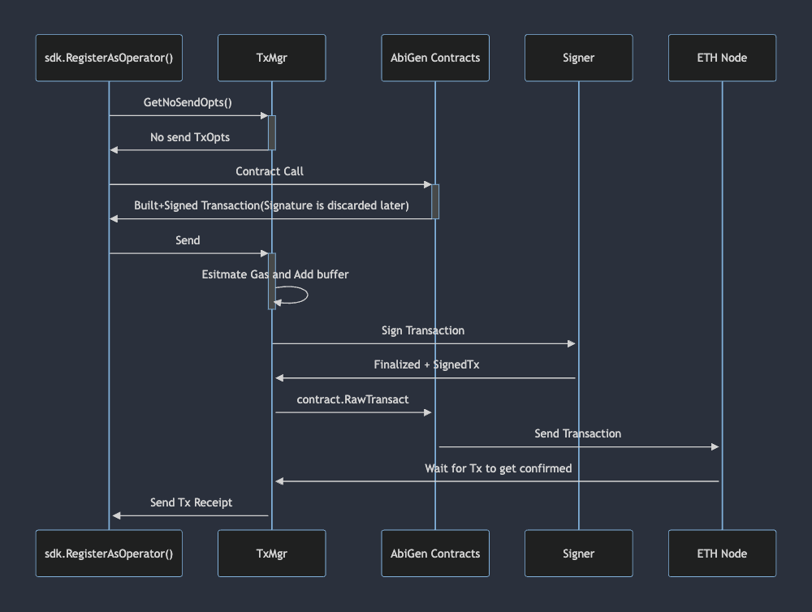

## Transaction Manager

Transaction Manager is responsible for
* Building transactions
* Estimating fees and adding gas limit buffer
* Signing transactions
* Sending transactions to the network
* Doing transaction nonce and gas price management to ensure transactions are mined

### Simple Transaction Manager
Here's the flow of the simple transaction manager which is used to send smart contract transactions to the network.

