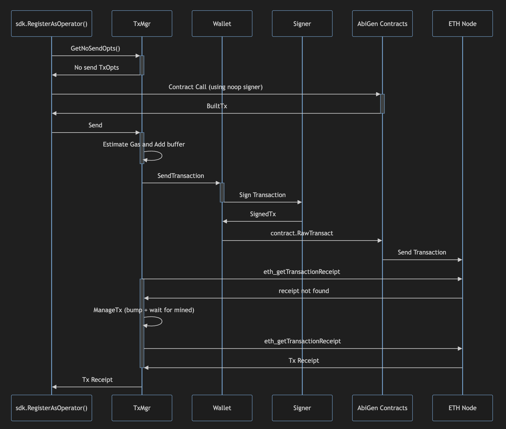

## Transaction Manager

Transaction Manager is responsible for
* Building transactions
* Estimating fees and adding gas limit buffer
* Signing transactions
* Sending transactions to the network
* Doing transaction nonce and gas price management to ensure transactions are mined

Here's the flow of the simple transaction manager which is used to send smart contract transactions to the network.

### Simple Transaction Manager

The simple txmgr simply sends transactions to the network, waits for them to be mined, and returns the receipt. It doesn't do any managing.

### Geometric Transaction Manager

The geometric txmgr is a more advanced version of the simple txmgr. It sends transactions to the network, waits for them to be mined, and if they are not mined within a certain time, it bumps the gas price geometrically and resubmits the transaction. This process is repeated until the transaction is mined.